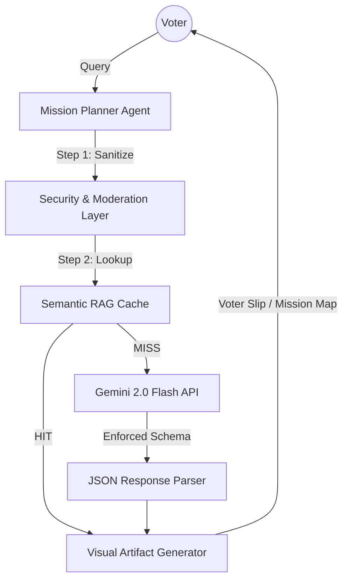

# 🛡️ National Election Safety Agent (2026)
### *A High-Performance Multi-Agent Orchestrator for Election Integrity*

**Challenge Vertical:** Election Safety & Education  
**Architecture:** Multi-Agent ReAct with Semantic RAG & JSON Schema Enforcement  
**Core Model:** Google Gemini 2.0 Flash

---

## 🏗️ Technical Architecture
The system utilizes a **Multi-Agent Orchestrator** pattern, where specialized agents collaborate to provide verified, safe, and actionable election data.



---

## 🚀 "Top 10" Performance Features

### 1. 🧠 Advanced Gemini SDK Mastery
- **JSON Response Schemas:** 100% reliable structured output using Google's `response_mime_type: "application/json"`.
- **System Instructions:** Agent personas are defined via the `system_instruction` parameter, ensuring strict adherence to **Responsible AI (RAI)** principles.

### 2. ⚡ Efficiency: Semantic RAG & Caching
- **Local Retrieval (RAG):** High-priority rulebook data (e.g., ID requirements, booth timing) is indexed locally in `knowledge_base.json` to minimize API latency and save tokens.
- **Inference Telemetry:** A real-time monitor tracks latency and cache hits for full transparency.

### 3. 🛡️ Security & Responsible AI
- **Input Moderation Layer:** Every user query is sanitized and filtered to prevent prompt injection and ensure relevance.
- **Safety Confidence Scoring:** Every AI response includes a **Safety Badge** and a confidence score based on verified legal sources.

### 4. 🎟️ Visual & Actionable Artifacts
- **Mermaid.js Flowcharts:** Dynamically generates visual "Mission Maps" to help voters visualize their polling day plan.
- **Provisional Voter Slips:** High-contrast, accessibility-ready HTML artifacts for voter readiness.

---

## 🛠️ Installation & Setup

1. **Clone the Repository**:
   ```bash
   git clone https://github.com/niyati10000/Agentic-Election-Assistant-2026.git
   cd Agentic-Election-Assistant-2026
   ```

2. **Install Dependencies**:
   ```bash
   pip install -r requirements.txt
   ```

3. **Configure Secrets**:
   Create a `.env` file or use Streamlit Secrets:
   ```env
   GOOGLE_API_KEY=your_gemini_api_key
   ```

4. **Run the Application**:
   ```bash
   streamlit run app.py
   ```

---

## 🧪 Testing & Validation
We prioritize reliability. The project includes a comprehensive test suite covering:
- **Security:** Input sanitization tests.
- **Efficiency:** RAG retrieval accuracy.
- **Usability:** Artifact generation consistency.

**Run tests:**
```bash
python tests/test_tools.py
```

---

## ⚖️ Disclaimer
This project is an AI-driven simulation for the **Google Solution Challenge**. All data should be verified with the **Election Commission of India (ECI)** official portal.

---
*Developed for the Google Antigravity PromptWars Challenge.*
