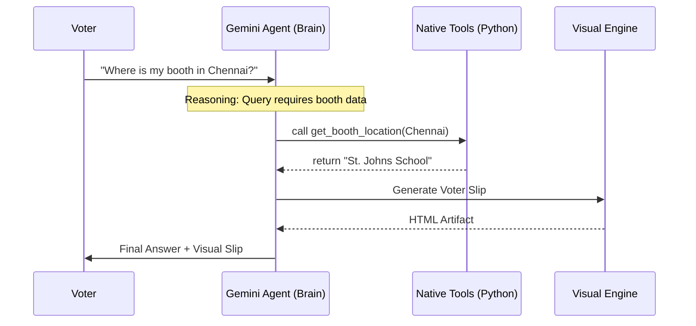

# National Election Safety Agent (2026)
> **Enterprise Multi-Agent Orchestrator for Election Integrity and Voter Education**

---

[](https://agentic-assistant-drhhk8qgaf5hssryi6meyb.streamlit.app/)
[](https://opensource.org/licenses/Apache-2.0)
[](https://www.python.org/downloads/)

The live application is deployed and accessible at:  
[https://agentic-assistant-drhhk8qgaf5hssryi6meyb.streamlit.app/](https://agentic-assistant-drhhk8qgaf5hssryi6meyb.streamlit.app/)

---

## Architecture Flow
The system is built on an autonomous tool-orchestration design. Google Gemini 2.0 Flash coordinates the workflow, dynamically routing queries to native helper tools based on conversation context.



---

## Major Updates & Refactoring Details

### Dynamic Diagram Engine
*   **Context:** The application previously crashed with an `AttributeError` when attempting to render regional analytics diagrams using a non-existent `st.mermaid` API.
*   **Resolution:** Developed a custom sandboxed rendering engine using Streamlit's HTML component. It loads the official `mermaid.js` library via CDN inside an iframe, rendering visual flows dynamically and securely on the client side.

### Search Sanity & RAG Integration
*   **Context:** The database-backed retrieval tool (`get_rag_response`) called an undefined helper (`sanitize_input`), raising standard NameError exceptions that failed silently under bare `except` blocks.
*   **Resolution:** Connected the RAG helper directly to the centralized validation pipeline (`sanitize_and_moderate`) in the moderation layer.
*   **Security & Testing:** Updated the unit test suite (`tests/test_tools.py`) to enforce strict assertions, ensuring the search module returns valid payload matches.

---

## Core System Capabilities

*   **Autonomous Tool Use:** The agent dynamically binds and calls local Python tools (`get_booth_location`, `check_election_rules`) based on conversation contexts.
*   **Input Moderation:** Subsystem checks (`shield/`) intercept malicious prompts, sanitize HTML strings, and prevent prompt injection threats.
*   **Persistent Sessions:** Leverages Gemini `ChatSession` instances to keep consistent system instructions and thread memory active during interaction loops.
*   **Production Configurations:** Built-in `cloudbuild.yaml` and `Procfile` templates ensure rapid containerized deployment.

---

## Setup & Deployment Guide

### Local Installation
1.  **Clone the project**:
    ```bash
    git clone https://github.com/niyati10000/Agentic-Election-Assistant-2026.git
    cd Agentic-Election-Assistant-2026
    ```
2.  **Install dependencies**:
    ```bash
    pip install -r requirements.txt
    ```
3.  **Configure environment secrets**:
    Create a `.env` file in the root directory:
    ```env
    GOOGLE_API_KEY=your_gemini_api_key_here
    ```

### Running the App
*   **Start the dashboard locally**:
    ```bash
    streamlit run app.py
    ```
*   **Run verification tests**:
    ```bash
    python -m unittest tests/test_tools.py
    ```

---

## Design Rationale
*   **Decoupled Structure:** The project is organized cleanly into four layers (`core/` for agent configs, `ui/` for styling, `shield/` for safety rules, and `utils/` for data tools) to allow independent scale-up.
*   **Optimized Latency:** Gemini 2.0 Flash is selected to ensure sub-second response times during real-time multi-turn reasoning tasks.

---

## Project Roadmap
1.  **Semantic Grounding:** Migrate from local JSON configurations to enterprise Vertex AI Search groundings.
2.  **Multimodal ID Processing:** Implement Gemini Vision checks to parse uploaded ID documents in the verification portal.
3.  **Vocal Assistance:** Integrate text-to-speech features to support visually impaired and elderly users.

---

*Developed for the Google Antigravity PromptWars Challenge. Distributed under the Apache License 2.0.*
