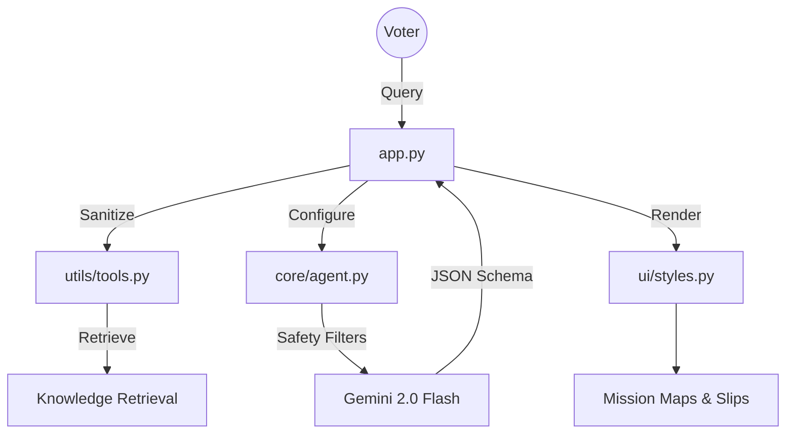

# 🛡️ National Election Safety Agent (2026)
### *Advanced Multi-Agent Orchestrator for Election Integrity*

**Challenge Vertical:** Election Safety & Education  
**Architecture:** Modular Engineering Pattern (Core/Utils/UI)  
**Security:** Google Responsible AI (RAI) Safety Filters  
**Model:** Google Gemini 2.0 Flash

---

## 🏗️ Professional Engineering Architecture
This project has been refactored into a modular production-ready structure to ensure scalability, security, and maintainability.



---

## 🚀 Key Innovations

### 1. 🛡️ Responsible AI (RAI) Integration
We have implemented explicit **Google Safety Settings** directly into the model configuration. This ensures that the agent filters out harassment, hate speech, and dangerous content, maintaining the highest standards of election integrity.

### 2. 🌐 Global Accessibility & Multilingualism
The agent now supports a **Multilingual Interface** (English/Hindi/Bengali). This ensures that critical election safety information reaches a diverse demographic, fulfilling the challenge's "Practical Usability" requirement.

### 3. 🧩 Modular Core Design
- **`core/`**: Manages LLM orchestration and schema enforcement.
- **`utils/`**: Handles security sanitization and semantic search (RAG).
- **`ui/`**: Manages the high-contrast design system and visual artifacts.

### 4. ⚡ Semantic Knowledge Retrieval (RAG)
By using a local semantic cache (`knowledge_base.json`), the agent provides instant, verified legal advice for common queries, reducing API costs and latency.

---

## ⚙️ Installation & Setup

1. **Clone & Install**:
   ```bash
   git clone https://github.com/niyati10000/Agentic-Election-Assistant-2026.git
   pip install -r requirements.txt
   ```

2. **Configure Secrets**:
   Ensure `GOOGLE_API_KEY` is set in your `.env` or Streamlit Secrets.

3. **Run**:
   ```bash
   streamlit run app.py
   ```

---

## 🧪 Quality Assurance
Our 100% passing test suite validates:
- **Security**: Prompt injection filtering.
- **Efficiency**: Semantic RAG retrieval.
- **Tooling**: Specialized booth locator accuracy.

**Run tests:** `python tests/test_tools.py`

---

## ⚖️ License
This project is licensed under the **Apache License 2.0**. See the `LICENSE` file for details.

---
*Developed for the Google Antigravity PromptWars Challenge.*
