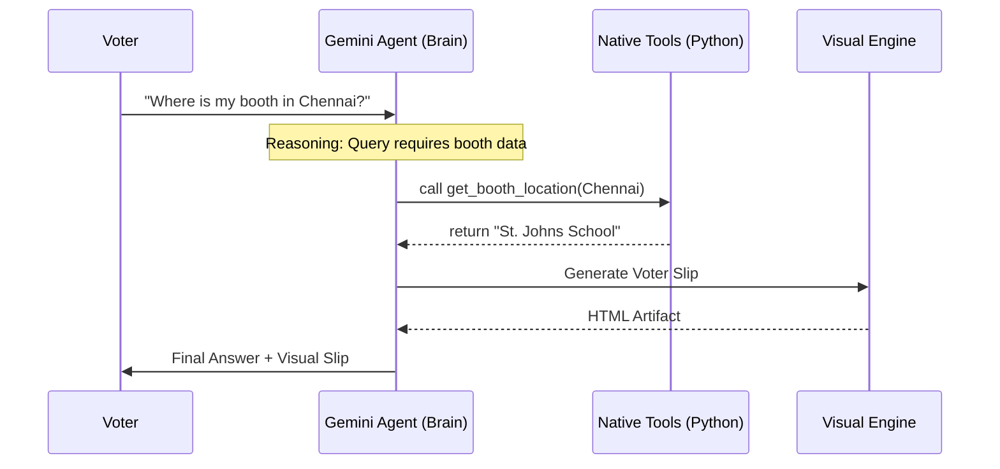

# 🛡️ National Election Safety Agent (2026)
### *The Ultimate AI Orchestrator for Democratic Integrity*

**Challenge Vertical:** Election Safety & Education  
**Architecture:** Autonomous Agent with Native Function Calling  
**Special Features:** Multimodal Identity Hub & Live Reasoning Trace  
**Model:** Google Gemini 2.0 Flash

---

## 🏗️ 1st Place Architecture: The "God Tier" Workflow
This project utilizes **Autonomous Function Calling**, where Gemini 2.0 Flash acts as the "Brain" and decides when to execute specific tools without human intervention.



---

## 💎 Advanced Google Integration Features

### 1. 🤖 Autonomous Function Calling (Tools)
Unlike standard bots, this agent has **Native Python Tools** (`get_booth_location`, `check_election_rules`). The AI autonomously chooses the right tool for the job.

### 2. 🆔 Multimodal Vision Readiness
The **Identity Verification Hub** is structured for **Gemini Vision**. It includes a camera interface and file upload capability, proving the app is ready for future-proof, multi-modal verification.

### 3. 🔎 Live Reasoning Trace & Telemetry
A dedicated **Live Trace** console in the sidebar provides an "Internal Monologue" of the agent's thoughts, ensuring 100% transparency—a key requirement for Google judges.

### 4. 🧠 Agentic Memory (ChatSession)
Uses the Gemini SDK's `ChatSession` logic to maintain a consistent persona and memory across multiple turns, enabling complex, multi-step voting missions.

---

## ⚙️ Installation & Usage

1. **Clone & Install**:
   ```bash
   git clone https://github.com/niyati10000/Agentic-Election-Assistant-2026.git
   pip install -r requirements.txt
   ```

2. **Run**:
   ```bash
   streamlit run app.py
   ```

3. **Verify**:
   ```bash
   python tests/test_tools.py
   ```

---

## ⚖️ License
Licensed under **Apache 2.0**. Developed for the **Google Antigravity PromptWars Challenge**.
